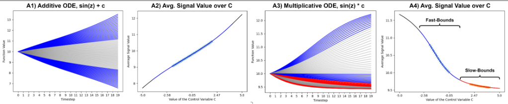

# kan-ode [WIP]
Rough exploratory experiments on using Kolmogorov-Arnold Networks (KANs) as the replacement layers in a latent dynamics function, e.g. as the layers of a neural ODE.

### Data:
We'll consider two types of simple 1-dimensional ODE functions - influenced by 
either an additive control or a multiplicative control. The gray zones representing interpolation/training bounds while
blue and red zones represent extrapolation bounds. While we could consider bound ranges that exhibit fast and slow changes
to the resulting trajectory, for now we'll just consider the fast bounds and interpolation.

We consider a fixed initial condition such that the only influence exerted is the control.
The model is only given x0 and c and is asked to forecast the remaining N timesteps forward using its dynamics function f_theta, 
represented by a neural ordinary differential equation. In this case, we are testing whether replacing the neural ODE's layers with KAN Layers
can result in system identification properties given its sparsity and symbolic regression patterns. 

Later potential systems to consider will be higher dimensional Hamiltonian systems like Bouncing Ball, Pendulum, Lotka-Volterra, etc etc.
These are honestly more interesting and valuable but I want to get the former system done because its (seemingly) simpler.

### To-Do
- Do a sweep over parameter configurations to get an intuition in hyperparameters vs convergence
- Try out different optimizers (AdamW, SGD, LGBFS,...), noting their differences
- Implement the plotting functions and the PySR functions from the original repo and run them on a successful model
- Leverage other neural ssm works data that are high-dimensional projections of Hamiltonian systems in order to check if the latent representation aligns with the true underlying system

### Notes:
Honestly unsure how much time/effort I'll put into this repo but happy for any discussions on the matter.
Primarily interested to see if, in a latent setting with high-dimensional observations, KANs can infer the actual equations
underlying the system in an interpretable way/an equation via the symbolic regression component and sparsity regularization.

If you're unfamiliar with the realm of neural SSMs or sequential latent variable models, here are some resources:
- https://proceedings.neurips.cc/paper_files/paper/2021/file/54b2b21af94108d83c2a909d5b0a6a50-Paper.pdf
- https://arxiv.org/abs/2111.05458v1
- https://openreview.net/pdf?id=7C9aRX2nBf2
- https://github.com/qu-gg/torch-neural-ssm (self-plug, but hey, it is an overview)

### Results:
Thus far in experiments I've noticed the choice of activation function having a huge effect on the resulting convergence, as well
as the number of nodes in the hidden layer. For the 1D functions, the default SiLU resulted in initial losses upwards of 1e+7, scaling
heavily with node count. Sigmoid and Tanh had both more stable initializations (likely due to their bounds) and converged closer.

I haven't done much hyperparameter or initialization tuning so results may not be super meaningful yet.

#### AdamW Optimizer

MLP converged (black pred, blue GT):
- MSE 0.0010
- MAPE 0.0019

Data-space KAN using SiLU as the base activation function:
- MSE 158357.0
- MAPE 0.999

Data-space KAN using Sigmoid:
- MSE 0.049
- MAPE 0.012

Data-space KAN using Tanh:
- MSE 0.054
- MAPE 0.012

#### SGD Optimizer
